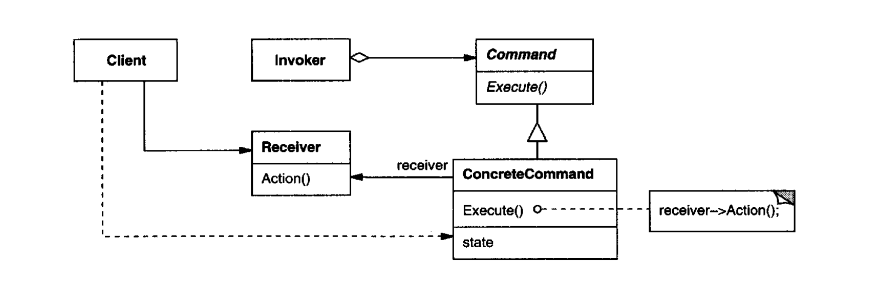

# Command

_Texbook_:
"Encapsulate a request as an object, thereby letting you parameterize clients with different requests, queue or log requests, and support undoable operations." 

---

### Problem:

---

### Structure:

---

### Participants:
<u>**Command:**</u> 
- declares an interface for executing an operation. 

<u>**ConcreteCommand:**</u> 
- defines a binding between a Receiver object and an action. 
- inmplements Execute by invoking the corresponding operation(s) on Receiver. 

<u>**Client:**</u> 
- creates a ConcreteCommand object and sets its receiver. 

<u>**Invoker:**</u> 
- aks the command to carry out the request. 

<u>**Receiver:**</u> 
- knows how to perform the operations associated with carrying out a request. Any class may serve as a Receiver. 

---

### Pros and Cons:
_Pros_:

✅  

_Cons_:

❌  