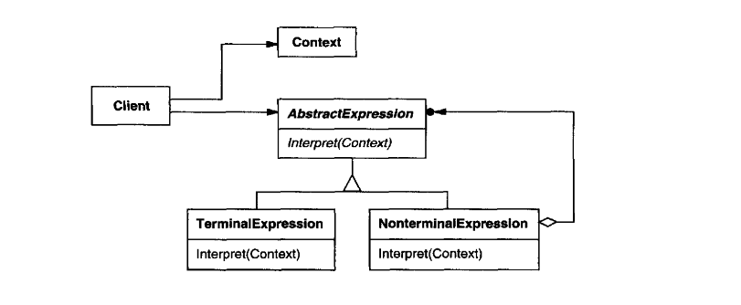

# Interpreter

_Texbook_:
"Given a language, define a representation for its grammar along with an interpreter that uses the representation to interpret sentences in the language." 

---

### Problem:

---

### Structure:

---

### Participants:
<u>**AbstractExpression:**</u> 
- declares an abstract Interpret operation that is common to all nodes in the abstract syntax tree. 

<u>**TerminalExpression:**</u> 
- implements an Interpret operation associated with terminal symbols in the grammar. 
- an instance is required for every terminal symbol in a sentence. 

<u>**NonterminalExpression:**</u> 
- one such class is required for every rule {R::== R_1, R_2...R_n} in the grammar. 
- maintains instance variables of tyope AbstractExpression for eahc of the symbols R1 through Rn. 
- implements an Interpret operation for nonterminal symbols in the grammar. Interpret typically calls itself recursively on the variables representing R1 through Rn. 

<u>**Context:**</u> 
- contains information that's global to the interpreter. 

<u>**Client:**</u> 
- builds _(or is given)_ an abstract syntax tree representing a particular sentence in the language that the grammar defines. The abstract syntax tree is assembled from instances of the NontermialExpression and TerminalExpression classess 
- invokes the Interpret operation. 

---

### Pros and Cons:
_Pros_:

✅  

_Cons_:

❌  