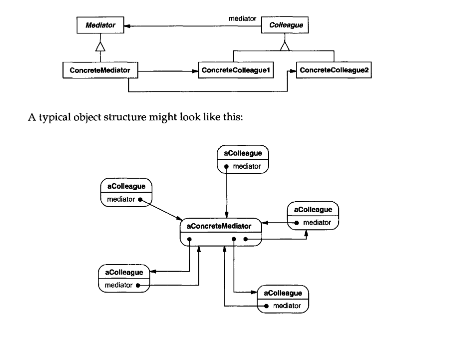

# Mediator

_Texbook_:
"Define an object that encapsulates how a set of obuects interact. Mediator promotes loose coupling by keeping objects from referring to each other explicitly, and it lets you vary their interaction independently." 

---

### Problem:

---

### Structure:

---

### Participants
<u>**Mediator:**</u> 
- defines an interface for communicating with Colleague objects. 

<u>**ConcreteMediator:**</u> 
- implements cooperative behavior by coordinating Colleague objects. 
- knows and maintains its colleagues. 

<u>**Colleague classes:**</u> 
- each Colleague class knows its mediator object. 
- each colleague communicates with its mediator whenever it would have otherwise communicated with another colleague. 

---

### Pros and Cons
_Pros_:

✅  

_Cons_:

❌  