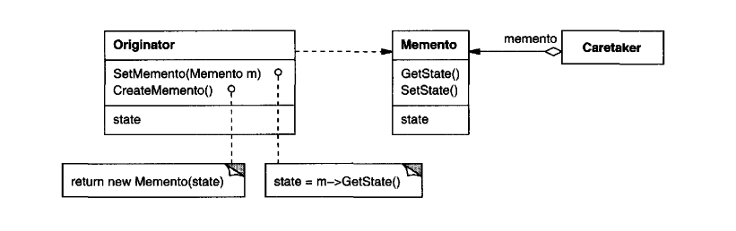

# Memento

_Texbook_:
"Without violating encapsulation, capture and externalize an object's internal state so that the object can be restored to this state later." 

---

### Problem:

---

### Structure:

---

### Participants:
<u>**Memento:**</u> 
- stores internal state of the Originator object. The memento may store as much or as little of the originator's internal state as necessary at its originator's discretion 
- protects against access by objects other than the originator. Mementos have effectively two interfaces. Caretaker sees a _narrow_ interface to the Memento - it can only pass the memento to other objects. Originator, in contrast, sees a wide interface, one that lets it access all the data necessary to restore itself to its previous state. Ideally, only the originator that produced the memento would be permitted to access the memento's internal state.

<u>**Originator:**</u> 
- creates a memento containing a snapshot of its current internal state. 
- uses the memento to restoer its internal state. 

<u>**Caretaker:**</u> 
- is responsible for the memento's safekeeping. 
- never operates on or examines the contents of a memento. 

---

### Pros and Cons
_Pros_:

✅  

_Cons_:

❌  