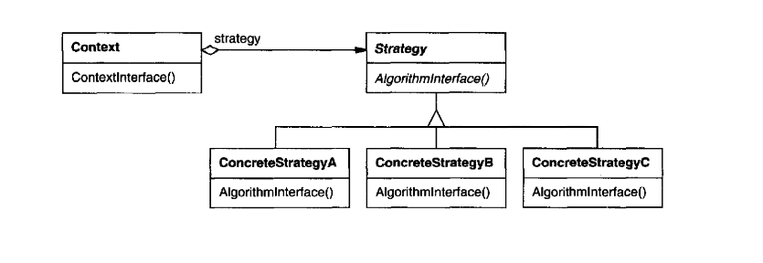

# Strategy

_Texbook_:
"Define a family of algorithms, encapsulate each one, and make them interchangeable. Strategy lets the algorithm vary independently from clients that use it." 

---

### Problem:

---

### Structure:

---

### Participants
<u>**Strategy:**</u> 
- declares an interface common to all supported algorithms. Context uses this interface to call the algorithm deined by a ConcreteStrategy. 

<u>**ConcreteStrategy:**</u> 
- implements the algorithm using the Strategy interface. 

<u>**Context:**</u> 
- is configured with a ConcreteStrategy object. 
- maintains a reference to a Strategy object. 
- may define an interface that lets Strategy access its data. 

---

### Pros and Cons
_Pros_:

✅  

_Cons_:

❌  