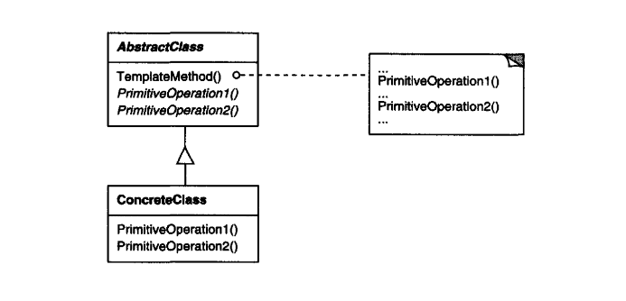

# Template

_Texbook_:
"Define the skeleton of an algorithm in an operation, deferring some steps to cubclasses. Template lets subclasses redefine certain steps of an algorihtn without changing the algorithm's structure." 

---

### Problem:

---

### Structure:

---

### Participants:
<u>**AbstractClass:**</u> 
- defines abstract **primitive operations** that concrete subclasses define to implement steps of an algorithm. 
- implements a template method defining the skeleton of an algorithm. The template method calls primitive operations as well as operations defined in AbstractClass or those of other objects. 

<u>**ConcreteClass:**</u> 
- implements the primitive operations to carry out subclass-specific steps of the algorithm. 

---

### Pros and Cons
_Pros_:

✅  

_Cons_:

❌  