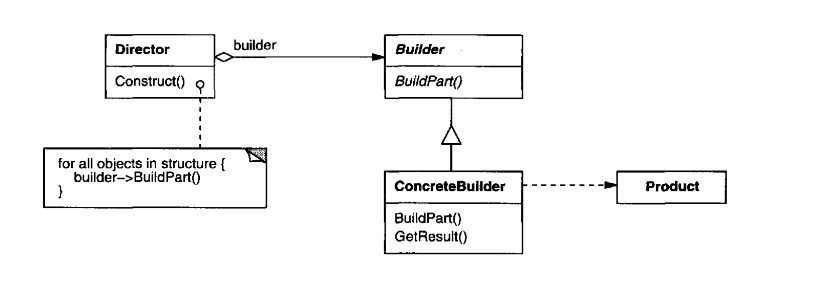

# Builder

_Texbook_:
"Separate the construction of a complex object from its representation so that the same construction process can create different represeentations." 

---

### Problem:

---

### Structure:

---

### Participants:
<u>**Builder:**</u> 
- specifies an abstract interface for creating parts of a Product object. 

<u>**ConcreteBuilder:**</u> 
- constructs and assenbles parts of the product by implementing the Builder interface. 

<u>**Director:**</u> 
- constructs an object using the Builder interface. 

<u>**Product:**</u> 
- represents the complex object under construction. ConcreteBuilder builds the product's internal represntation and defines the process by which it's assembled. 
- includes classes that define the constituent parsts, including interfaces for assembling the parts into the final result. 

---

### Pros and Cons:
_Pros_:

✅  

_Cons_:

❌  