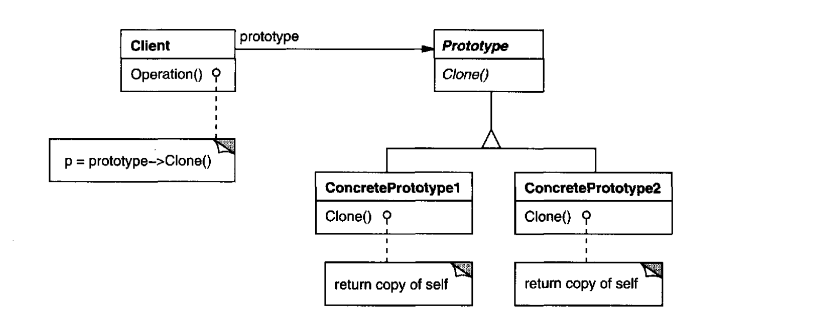

# Prototype
**Prototype** is a creational design pattern that lets you copy existing objects without making your code dependent on their classes.

_Texbook_:
"Specify the kinds of objects to create using a prototypical instance, and create new objects by copying this prototype." 

---

### Problem:
When creating a new object from scratch becomes costly—whether in time, resources, or complexity—you shouldn’t have to rebuild it step by step every time. Instead, you can duplicate an existing, fully initialized instance and adjust only what you need. The Prototype pattern enables this by allowing objects to be cloned or copied directly, avoiding the overhead of repeated construction.

<u>EX:</u> **🎮 Video Game Loadout**

Imagine you're building a video game where players can customize characters with outfits, weapons, abilities, and stats. Creating each new character from scratch is slow and repetitive—especially when many characters share similar configurations.

Instead, you create prototypes such as “Sniper Loadout,” “Tank Loadout,” or “Healer Loadout.”
When a player wants one, you clone the prototype and tweak only a few settings (e.g., change a weapon or ability).

This avoids redoing all the setup logic every time and keeps the system flexible when new presets are added.

---

### Structure:

---

### Applicability:
- when the classes to instantiate are specified at run-time, for example, by dynamic loading; or
- to avoid building a class hierarchy of factories that parallels the class hierarchy of product; or
- when instances of a class can have one of only a few different combinations of state. It may be more convenient to install a corresponding number of prototypes and clone them rather than instantiating the class manually, each time with the appropriate state.

---

### Participants:
<u>**Prototype:**</u> 
- declares an interface for cloning itself. 

<u>**ConcretePrototype:**</u> 
- implements an operation for cloning itself. 

<u>**Client:**</u> 
- creates a new object by asking a prototype to clone itself.

---

### Pros and Cons:
_Pros_:

✅ You can clone objects without coupling to their concrete classes. 
✅ You can get rid of repeated initialization code in favor of cloning pre-built prototypes. 
✅ You can produce complex objects more conveniently. 
✅ You get an alternative to inheritance when dealing with configuration presets for complex objects. 

_Cons_:

❌ Cloning complex objects that have circular references might be very tricky. 