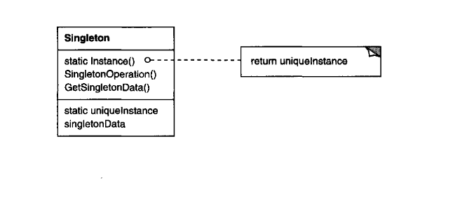

# Singleton

**Singleton** is a creational design pattern that lets you ensure that a class has only one instance, while providing a global access point to this instance.

_Texbook_:
"Ensure a class only has one instance, and provide a global point of access to it." 

---

### Problem:
There are cases where you may want to keep one instance of a class that keeps the data consistent that many applications may want to have the same thing.

<u>EX:</u> **📁 Loggin System**

Imagine you are building a logging system for an application. You want all parts of your application — different modules, services, and background tasks — to log messages consistently to the same log file.

You need exactly one logger instance that every part of the program can access globally. The Singleton pattern solves this problem by ensuring there is only one instance of the logger and providing a single, well-known access point for all modules.

---

### Applicability:
- there must be exactly one instance of a class, and it must be accessible to clients from a well-known access point.
- when the sole instance should be extensible by subclassing, and clients should be able to use an exteded instance without modifying their code.

---

### Structure:

---

### Participants:
<u>**Singleton:**</u> 
- defines an Instance operation that lets clients access its unique instance. Instance is a class operation. 
- may be responsible for creating its own unique instance. 

---

### Pros and Cons:
_Pros_:

✅ You can be sure that a class has only a single instance. 
✅ You gain a global access point to that instance. 
✅ The singleton object is initialized only when it’s requested for the first time.. 

_Cons_:

❌ Violates the Single Responsibility Principle. The pattern solves two problems at the time. 
❌ The Singleton pattern can mask bad design, for instance, when the components of the program know too much about each other. 
❌ The pattern requires special treatment in a multithreaded environment so that multiple threads won’t create a singleton object several times. 
❌ It may be difficult to unit test the client code of the Singleton because many test frameworks rely on inheritance when producing mock objects. Since the constructor of the singleton class is private and overriding static methods is impossible in most languages, you will need to think of a creative way to mock the singleton. Or just don’t write the tests. Or don’t use the Singleton pattern. 