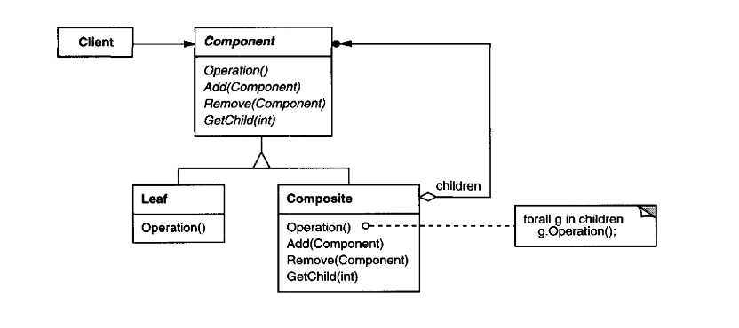
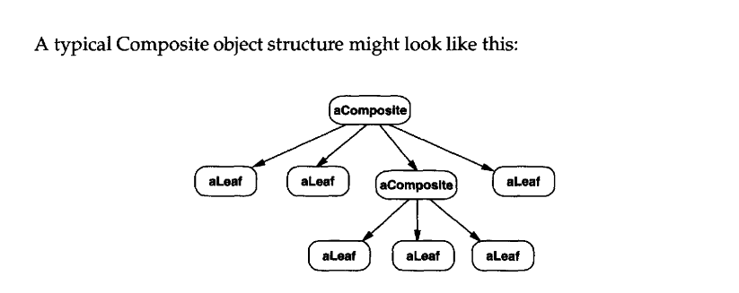

# Composite

_Texbook_:
"Compose objects into tree structures to represent part-whole hierarchies. Composite lets clients treat individual objects and compositions of object uniformly." 

---

### Problem:

---

### Structure:

---

### Participants:
<u>**Component:**</u> 
- defines the domain-specific interface that Client uses. 

<u>**Leaf:**</u> 
- collaborates with objects conforming to the Target interface. 

<u>**Composite:**</u> 
- defines an existing interface that needs adapting. 

<u>**Client:**</u> 
- adapts the interface of Adaptee to the Target interface. 

---

### Pros and Cons:
_Pros_:

✅  

_Cons_:

❌  