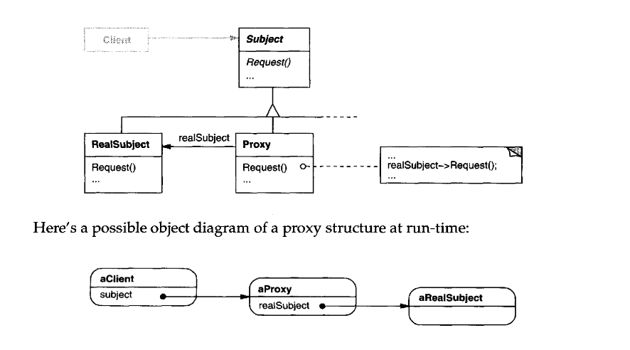

# Proxy

_Texbook_:
"Provide a surrogate or placeholder for another object to control access to it." 

---

### Problem:

---

### Structure:

---

### Participants:
<u>**Proxy:**</u> 
- maintains a reference that lets the proxy access the real subject. Proxy may refer to a Subject if the RealSubject and Subject interfaces are the same. 
- provides an interface identical to Subject's so that a proxy can be substituted for the real subject. 
- controls access to the real subject and may be responsible for creating and deleting it. 
- other responsibilities depend on the kind of proxy: 
<t>1) **<i>Remote Proxies</i>** are responsible for encoding a request and its arguments and for sending the encoded request to the real subject in a different address space. 
<t>2) **<i>Virtual Proxies</i>** may cache additional information about the real subject so that they can postpone accessing it. For example, the ImageProxy form the Motivation caches the real image's extend. 
<t>3) **<i>Protection Proxies</i>** check that the caller has the access permissions required to perform a request. 

<u>**Subject:**</u> 
- defines the common interface for RealSubject and Proxy so that a Proxy can be used anywhere a RealSubject is expected. 

<u>**RealSubject:**</u> 
- defines the real object that the proxy represents. 

---

### Pros and Cons:
_Pros_:

✅  

_Cons_:

❌  